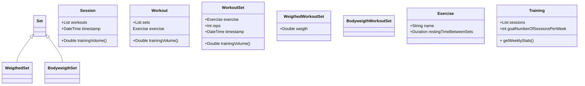

```mermaid
classDiagram
    Set <|-- WeigthedSet
    Set <|-- BodyweigthSet

    class Session {
        +List<Workout> workouts
        +DateTime timestamp
        +Double trainingVolume()
    }

    class Workout {
        +List<Set> sets
        Exercise exercise
        +Double trainingVolume()
    }

    class WorkoutSet {
        +Exercise exercise
        +Int reps
        +DateTime timestamp
        +Double trainingVolume()
    }

    class WeigthedWorkoutSet {
        +Double weigth
    }

    class BodyweigthWorkoutSet {
    }

    class Exercise {
        +String name
        +Duration restingTimeBetweenSets
    }

    class Training {
        +List<Session> sessions
        +int goalNumberOfSessionsPerWeek
        + getWeeklyStats()
    }


```
