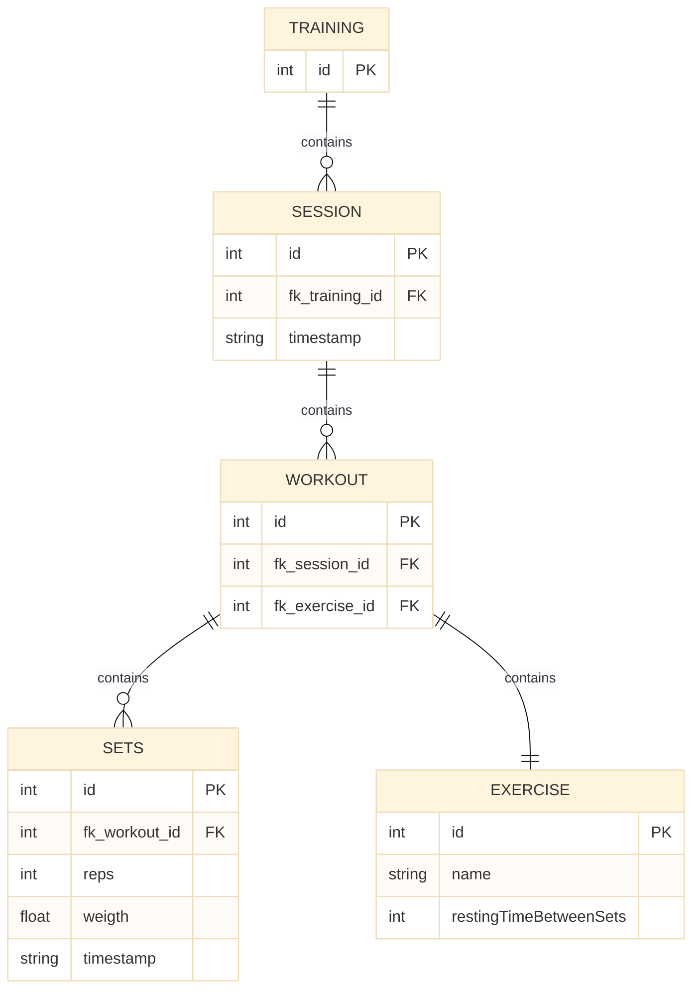

```mermaid
%%{init: {'theme':'base'}}%%

erDiagram
    SESSION ||--o{ WORKOUT : contains
    SESSION {
        int id PK
        int fk_training_id FK
        string timestamp
    }
    WORKOUT ||--o{ SETS : contains
    WORKOUT || -- || EXERCISE : contains
    WORKOUT {
        int id PK
        int fk_session_id FK
        int fk_exercise_id FK
    }
    SETS {
        int id PK
        int fk_workout_id FK
        int reps
        float weigth
        string timestamp
    }
    EXERCISE {
        int id PK
        string name
        int restingTimeBetweenSets
    }
    TRAINING ||--o{ SESSION : contains
    TRAINING {
        int id PK
    }

```
